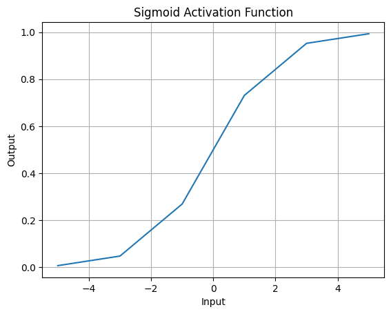
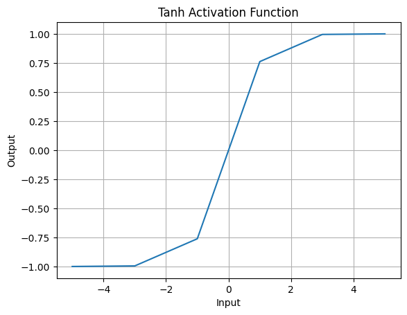
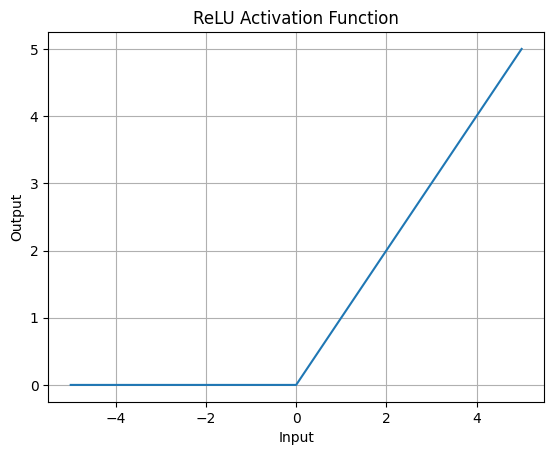
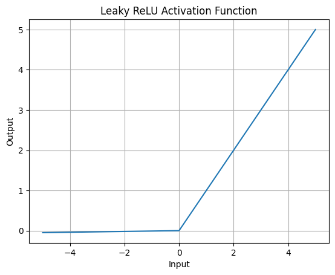

# Activation Functions – GenAI Internship Assignment

This repository contains my GenAI Internship Assignment focused on understanding and implementing activation functions used in neural networks using Python and NumPy, along with visual output plots for clear and intuitive learning.

## Objective
The objective of this assignment is to:
- Implement common activation functions used in neural networks
- Understand their mathematical behavior
- Visualize how they transform input values
- Build a strong foundation for Neural Networks and Generative AI

## Tools & Technologies
- Python
- NumPy
- Matplotlib
- Google Colab 

## Input Values Used
The following input values were used to observe the behavior of each activation function for negative, zero, and positive inputs:

```python
x = np.array([-5, -3, -1, 0, 1, 3, 5])
```

---

## 1. Sigmoid Activation Function
**Mathematical Formula:**

$$
f(x) = \frac{1}{1 + e^{-x}}
$$

**Example Code:**
```python
def sigmoid(x):
    return 1 / (1 + np.exp(-x))
y_sigmoid = sigmoid(x)
```

**Output Behavior:**
- Output range: 0 to 1
- Smooth S-shaped curve
- Commonly used for binary classification

**Example Output Plot:**


---

## 2. Tanh (Hyperbolic Tangent)
**Mathematical Formula:**

$$
f(x) = \frac{e^x - e^{-x}}{e^x + e^{-x}}
$$

**Example Code:**
```python
def tanh(x):
    return np.tanh(x)
y_tanh = tanh(x)
```

**Output Behavior:**
- Output range: -1 to 1
- Zero-centered output
- Provides better gradient flow than sigmoid

**Example Output Plot:**


---

## 3. ReLU (Rectified Linear Unit)
**Mathematical Formula:**

$$
f(x) = \max(0, x)
$$

**Example Code:**
```python
def relu(x):
    return np.maximum(0, x)
y_relu = relu(x)
```

**Output Behavior:**
- Outputs zero for all negative values
- Linear for positive values
- Fast and widely used in hidden layers

**Example Output Plot:**


---

## 4. Leaky ReLU
**Mathematical Formula:**

$$
f(x) = \max(0.01x, x)
$$

**Example Code:**
```python
def leaky_relu(x, alpha=0.01):
    return np.where(x > 0, x, alpha * x)
y_leaky_relu = leaky_relu(x)
```

**Output Behavior:**
- Allows small gradient for negative values
- Solves the dead ReLU problem

**Example Output Plot:**


---

## About the Output Images
All images used in this repository are generated directly from the notebook using Matplotlib. They represent the real execution output of the code and are included for better visual understanding.

## Repository Structure
```
Activation-Functions-GenAI/
│   ├── Activation_Functions_GenAI.ipynb
│   ├── README.md
│   └── images/
│       ├── sigmoid.png
│       ├── tanh.png
│       ├── relu.png
│       └── leaky_relu.png
```

## Learning Outcomes
- Gained a clear understanding of why activation functions are required
- Learned how non-linearity is introduced in neural networks
- Implemented activation functions from scratch using NumPy
- Understood activation behavior using visual plots
- Built a strong foundation for forward and backpropagation

## Next Steps
- Implement forward propagation
- Understand loss functions
- Implement backpropagation
- Build a simple neural network using NumPy
- Transition to PyTorch or TensorFlow


---

## 🔗 Learning Page

👉 **URL:**  
https://bhuvanesh-m-dev.github.io/genai-intern-zeno-talent/What%20I%20Learned%20from%20This%20Internship/week5


---
