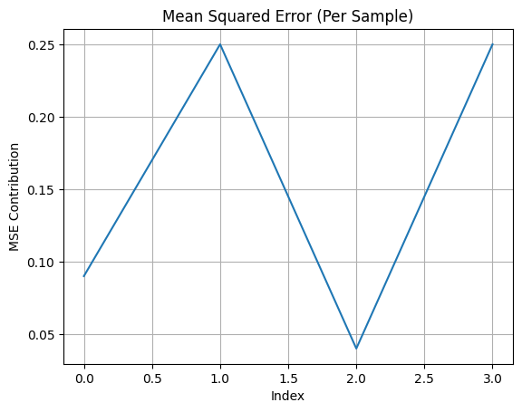
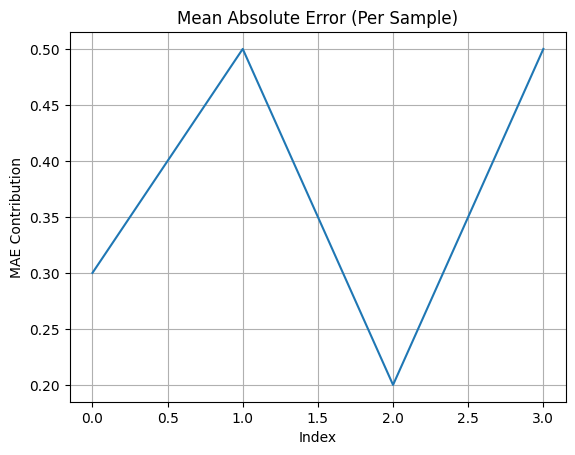
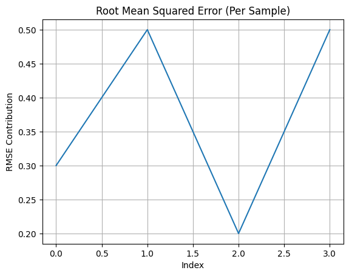

# Loss Functions — Visualization & Learning Exercise

This project implements and visualizes different regression loss functions using a common set of predicted and actual values. The goal of this exercise is to understand how each loss function penalizes prediction errors and why they are used in Machine Learning models.

---

## 📌 Loss Functions Implemented

- **Mean Squared Error (MSE)**
- **Mean Absolute Error (MAE)**
- **Root Mean Squared Error (RMSE)**

Each loss is computed for the same input values and visualized using graphs to understand their behavior.

---

## 🖼 Output Visualizations

### 📊 Mean Squared Error (MSE)

### 📊 Mean Absolute Error (MAE)

### 📊 Root Mean Squared Error (RMSE)

---

## 🎯 What I Learned From This Exercise

- How different loss functions react to **small vs large errors**
- Why **MSE penalizes larger errors more strongly** due to squaring
- Why **MAE is more stable and robust to outliers**
- How **RMSE is derived from MSE** and adds interpretability in original units
- How NumPy and Matplotlib are used to perform **ML experimentation**
- Practical understanding of **error evaluation in ML models**

This exercise strengthened my foundation in:
- Regression learning concepts  
- Model performance evaluation  
- Preparing datasets for further ML experiments

---

## 🔗 Learning Page

👉 **URL:**  
https://bhuvanesh-m-dev.github.io/genai-intern-zeno-talent/What%20I%20Learned%20from%20This%20Internship/week5

---

## 🚀 Next Steps

- Add **classification loss functions** (BCE, CCE)
- Compare regression vs classification losses
- Apply losses inside a **Neural Network training example**
- Extend to **real-world dataset experiments**

---

🧩 *This mini-project is part of my continuous learning journey in Machine Learning and Neural Network fundamentals.*

  

 
 <h3 align="center">
    🌌 You are my &nbsp;
    
    &nbsp; visitor. Welcome to my orbit.
</h3>

  

