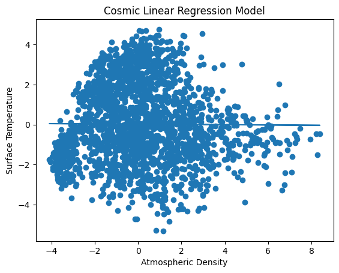

# Cosmic Linear Regression — Surface Temperature Prediction

This project implements a **Linear Regression model** using a cosmic environmental dataset to predict **Surface Temperature** based on planetary and atmospheric features. The objective is to understand how supervised regression models are trained, evaluated, and visualized using real numerical data.

The project is implemented as a **Google Colab (.ipynb)** notebook and demonstrates the complete ML workflow—from data loading to model training, evaluation, and result visualization.

---

## 📌 Project Overview

* **Learning Type:** Supervised Machine Learning
* **Model Used:** Linear Regression
* **Target Variable:** Surface Temperature
* **Primary Feature:** Atmospheric Density
* **Environment:** Google Colab (Python)

---

## 🧠 Dataset Description

The dataset contains simulated cosmic and planetary attributes such as:

* Atmospheric Density
* Surface Temperature
* Gravity
* Water Content
* Mineral Abundance
* Orbital Period
* Proximity to Star
* Magnetic Field Strength
* Radiation Levels
* Atmospheric Composition Index

The dataset is used to build a regression model that learns the relationship between **Atmospheric Density** and **Surface Temperature**.

---

## 🛠️ Workflow Implemented

1. Import required Python libraries
2. Load the cosmic dataset
3. Select feature (X) and target (Y)
4. Split data into training and testing sets
5. Train Linear Regression model
6. Generate predictions
7. Evaluate model performance using MSE and R² Score
8. Visualize actual vs predicted values
9. Save the trained model for reuse

---

## 🖼 Output Visualization

### 📊 Linear Regression Prediction Graph

This graph shows:

* Scatter plot of actual test values
* Regression line representing model predictions

---

## 📈 Model Evaluation Metrics

* **Mean Squared Error (MSE):** Measures average squared prediction error
* **R² Score:** Indicates how well the model explains the variance in data

These metrics help assess the accuracy and reliability of the trained regression model.

---

## 🎯 What I Learned From This Project

* Practical implementation of **Linear Regression**
* Understanding **feature–target relationships**
* Importance of **train-test splitting**
* How prediction error is measured using MSE and R²
* Visualization techniques for regression models
* Saving and reusing trained ML models

This project strengthened my understanding of:

* Supervised learning concepts
* Regression modeling
* Model evaluation and interpretation

---

## 🚀 Future Enhancements

* Add **multiple features** (multivariate regression)
* Try **polynomial regression**
* Compare with **regularization techniques** (Ridge, Lasso)
* Extend to **classification-based cosmic predictions**
* Apply the model to real-world scientific datasets

---

## 📚 Dataset Credits

This project uses the **Cosmic Dataset** sourced from Kaggle:

🔗 **Source:** [https://www.kaggle.com/datasets/jainhemang/cosmic](https://www.kaggle.com/datasets/jainhemang/cosmic)

All credits for the dataset collection and curation go to the original author. This project uses the dataset strictly for **educational and learning purposes**.

---

🧩 *This project is part of my continuous learning journey in Machine Learning fundamentals and applied model building.*

